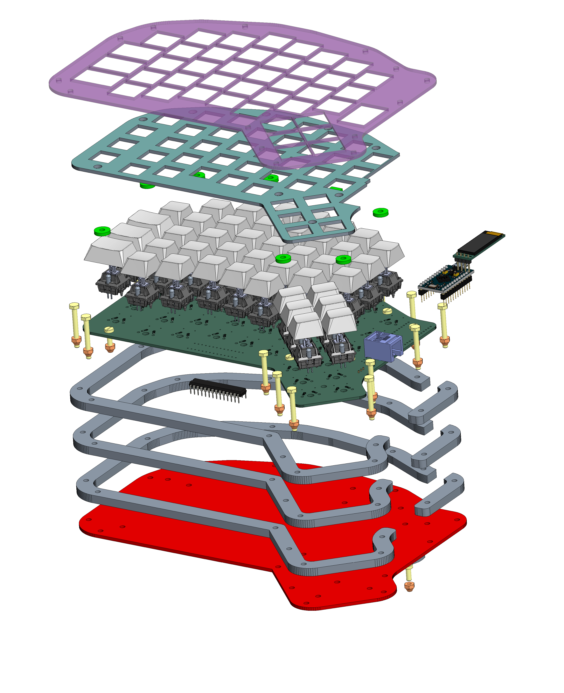

<h1 align="center">🌿 <i>SUDI</i> Keyboard V2</h1>
<p style="align: right;">
 
</p>

<p >
  <a href="">
    
  </a>
  <a href="">
    
  </a>
  <a href="">
    
  </a>
  <a href="https://github.com/ahsanu123/sudi-keyboard/blob/main/LICENSE">
    
  </a>
</p>


Sudi V2 is custom wireless split keyboard based on NRF52832 Nordic Semiconductor Microcontroller series, each side consist 18 keys 36 in totals, use MCP23017 I2C I/O expansion to scan one side of keyboard, and use wire to trasfer data to NRF52. Built in SWD debug port, with Serial Logger based on CH340G. Sudi Have interactive RGB LED and OLED 0.91 inch for graphic display. Planned to create 3D print enclosure.

## 🖨️ Compile And Flash

🍮 Step to Compile and flash (Zephyr)

first activate your python environtment (i use micromamba, sudiv2 is environtment on my linux pc) 
```shell
micromamba activate sudiv2
```
next build with `west` 
```shell
west build -b sudi app
```

---

🍮 Step to Compile and flash (Makefile and Native toolchain)

1. because we use makefile just call `make` in root directory
2. after complete you can use jlink or stlink to program your binary, nrf can programmed with swd
3. to use jlink you can use this command `sudo JLinkExe -Device NRF51822_XXAA -IF swd -AutoConnect 1 -Speed 1000` then you can load binary file with `loadfile ./path/to/file.out` (we use .out instead .elf)
4. to use stlink you can use this [script](https://github.com/vedderb/nrf51_vesc) you need change .out path
```shell
#!/bin/bash
openocd -f openocd.cfg -c "init" \
  -c "halt" \
  -c "nrf51 mass_erase" \
  -c "program ./build/binary.out verify reset exit"
```

## 🐞 Debugging Step

there is many way to debug NRF microcontroller, i will use JLink V8. first connect Jlink SWD to NRF MCU. 

after compile, upload your binary with jlink 
```shell
 sudo JLinkExe -Device NRF51822_XXAA -IF swd -AutoConnect 1 -Speed 1000 // change device based on your device
```
next inside `JLinkExe` run load binary file with `loadfile ./path/to/your/file.elf` (you can automate this with text script, but i just want write it to remember).

then start `openocd` debug server with

```shell
sudo openocd -f interface/jlink.cfg  -c "transport select swd; adapter speed 1000" -f target/nrf51.cfg &
```

finally you can start your debugger in this case we use `arm-none-eabi-gdb` then connect to target with this step (withtout `>`)

```shell
> file ./path/to/your/file.elf
> break main.c:22 //optional
> target extended-remote :3333 // default port for openocd debug server
> // devices connected
```

if debugger will _stuck_ on `fail.c` after _arch interrupt lock_ there maybe some bad/wrong setting(recheck your config).


<details>
  <summary>🍷 Old Debug Step (here for history purpose only)</summary>
  
  to debug you can use openocd + stlink, openocd + jlink, ozone. make sure to change `gdbcmd.txt` based on your setting (gdb port, output filename, etc.)

```shell
//🗒️🗒️🗒️🗒️ gdbcmd.txt 🗒️🗒️🗒️🗒️🗒️
// you need to connect into server first before choosing `file` to debug, 
target extended-remote :3333
file ./build/nrf51822_xxaa.out
break main
continue
```

- openocd + stlink
  first start openocd gdb server with this command
  
 ```shell
   sudo openocd -f interface/stlink-v2.cfg -f target/nrf51.cfg &
  ```
 
  next you can use `arm-none-eabi-gdb` to debug your program, run this command on other terminal `arm-none-eabi-gdb -x gdbcmd.txt`

- openocd + jlink
 you can start jlink gdb server with this command `sudo JLinkGDBServerExe &` then choose device and peripheral (swd) , or you can start server with openocd

 ```shell
  sudo openocd -f interface/jlink.cfg  -c "transport select swd; adapter speed 1000" -f target/nrf51.cfg
  ```

  next you can use `arm-none-eabi-gdb` to debug your program, run this command on other terminal `arm-none-eabi-gdb -x gdbcmd.txt`
  
- ozone
  last option you can use segger ozone. (not trying yet)
</details>

<details>
  <summary>expand this if you curious (historic purpose only)</summary>
  
- **Ok!!**, I need 2 days (on my weekend) for figuring out how compile in NRF51 mcu with NRF5 SDK (at time of writing NRF5 SDK was obsolete/under maintenance only by Nordic Semiconductor). 

- **FIRST** as far as i understand NRF51 MCU series only work with NRF5 sdk below version 12 (never complete compiling with version above 12), so you need to download NRF5 SDK version 12 or below. 

- **SECOND** i have try to compile nrf project with cmake, but fail and make me stress, so i stick with makefile

- **THIRD** debugging with `arm-eabi-none-gdb` a bit tricky you need perform several command before program go into breakpoint.

- **FOURTH** you need to use old gcc compiler (gcc-arm-none-eabi-4_9-2015q3-20150921-linux.tar.bz2), there is some problem in linking process when you use new gcc version like v14
</details>


## 💾 hardware 
hardware is designed with Kicad, you can find out hardware design in `pcb-design` folder. 


casing is designed with PTC CREO, and use cutting acrylic (not uploaded/complete yet but planned)  
<details>
  <summary>Expand Me </summary>
  <p align="center">
  <a href="https://youtu.be/LN7CI2rUKP8">
    
  </a>
</p>


</details>

## 🪜 Install Module In Zephyr
zephyr use _manifest_(west.yml) to setting what module used. to automatic install module, add module name after `name-allowlist`, here is example.

```yaml
manifest:
  self:
    west-commands: scripts/west-commands.yml

  remotes:
    - name: zephyrproject-rtos
      url-base: https://github.com/zephyrproject-rtos

  projects:
    - name: zephyr
      remote: zephyrproject-rtos
      revision: main
      import: 
        name-allowlist:
          - cmsis      # required by the ARM port
          - hal_nordic # required by the custom_plank board (Nordic based)
          - hal_stm32  # required by the nucleo_f302r8 board (STM32 based)
          - segger # add another component based on module repository

```

after edit `west.yml` run `west update`, `west` will update the module based on manifest.

`west` will search to this [repo](https://github.com/zephyrproject-rtos/zephyr/tree/main/modules), then download and install it based on your zephyr root.

after you installed (download) zephyr module you can enable with `menuconfig`, you can run menuconfig with 
```shell
west build -t menuconfig
```

## 🧱 TODO List 


- ~~try to understand why linker script flash ram address need to change from `0x8000` to `0x4000` [look this thread](https://devzone.nordicsemi.com/f/nordic-q-a/78577/nrf-sdk-pre-built-blinky-hex-works-compiled-hex-does-not-nrf51822)~~, use Zephyr instead.
- ~~update hardware readme.md section, add schematic svg~~
- ~~try to logging with segger jlink rtt~~ at 9 september 2024 22:09
- try to logging with serial logger
- ~~add usb to serial (ch340g) if serial logger worked /or considering to use segger rtt (worked and tested on NRF51822)~~
- ~~add on off switch for board~~
- ~~🦀 Change design to use NRF52832~~
- 🔥 Learn more about Zephyr
- ~~change JTAG debugger to component with less space and same pinout based on JLink v8 pinout.~~
- 🔋 battery/and its charger need adjustment, because NRF5232 power supply range is 1.7 V to 3.6 V , and TP4056 will shutdown on 4.2V. if you add AMS1117 3.3v to regulate it, AMS1117 need at least 4.5V to maintain its 3.3V.
- 🔋 read about BQ24075 bms datasheet
- 🔋 Read about  MAX17048  datasheet
- 🔋 if we use 1.8V for NRF Voltage supply, how its affect other used component
  - 🪔 WS2812 VIO level was not satisfied, based on its datasheet, min supply is 3.5, VIH 0.7*VDD (2.45), VIL 0.3 *VDD (1.05)
  - ⚗️ based on MCP23017 datashet its power voltage range is 1.8V to 5.5v, VIH 0.25 VDD + 0.8, VIL 0.8 VDD, so its possible to use MCP23017 with 1.8V NRF voltage supply,
  - 🐤 CH340G
- 🔶check 4 pin crystal compatibility

## 💳 Reference 
- [you need to read this if blink example not working](https://devzone.nordicsemi.com/f/nordic-q-a/78577/nrf-sdk-pre-built-blinky-hex-works-compiled-hex-does-not-nrf51822)
- [NRF51 Series Documentation](https://www.nordicsemi.com/Products/nRF51822/GetStarted)
- [Redox-Keyboard](https://github.com/mattdibi/redox-keyboard) i use redox schematic for initial design  
- [MCP23017 datasheet](reference/MCP23017-20001952c.pdf) and add my *initial redox sch* with MCP23017
- [Zephyr Devices Tree](https://docs.zephyrproject.org/latest/build/dts/)

<sup>🔥 make it V2 - 19 juni 2024 10:49</sup>
