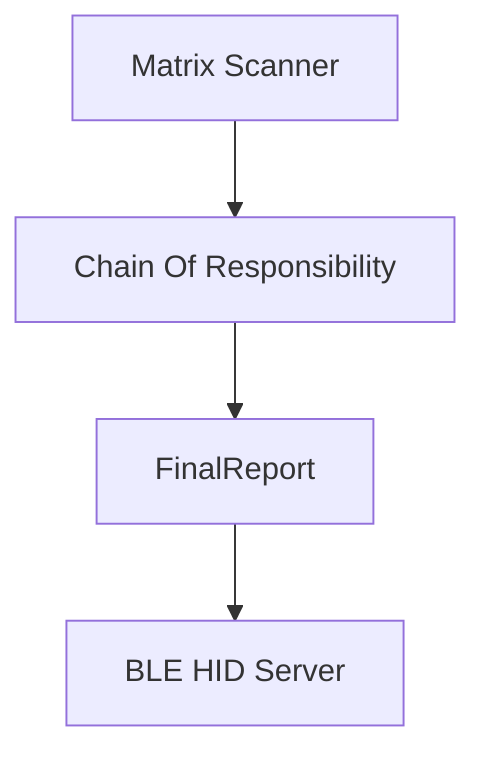

<p >
  <a href="">
    
  </a>
  
  <a href="">
    
  </a>
  
  <a href="">
    
  </a>
  
  <a href="https://github.com/ahsanu123/sudi-keyboard/blob/main/LICENSE">
    
  </a>

  <a href=" ">
    
  </a>
  
</p>

<p style="align: right;">
   
</p>
 
# 🌿 _Sudi_ V2

Sudi V2 is custom wireless split keyboard based on NRF52832 Nordic Semiconductor Microcontroller series, each side consist 18 keys 36 in totals, use MCP23017 I2C 
I/O expansion to scan one side of keyboard, and use wire to trasfer data to NRF52. Built in SWD debug port, with Serial Logger based on CH340G. Sudi Have interactive 
RGB LED and OLED 0.91 inch for graphic display. Planned to create 3D print enclosure.


## 💾 hardware 
hardware is designed with Kicad, you can find out hardware design in `pcb-design` folder. 


**Over simplified workflow**


<details>
  <summary>Casing Design</summary>
 
   

</details>

## 🔥 Progress Log


<details>
  <summary>expand this to see current progress 🍰 </summary>

- ~~try to understand why linker script flash ram address need to change from `0x8000` to `0x4000` [look this thread](https://devzone.nordicsemi.com/f/nordic-q-a/78577/nrf-sdk-pre-built-blinky-hex-works-compiled-hex-does-not-nrf51822)~~, use Zephyr instead.
- ~~update hardware readme.md section, add schematic svg~~
- ~~try to logging with segger jlink rtt~~ at 9 september 2024 22:09
- try to logging with serial logger
- ~~add usb to serial (ch340g) if serial logger worked /or considering to use segger rtt (worked and tested on NRF51822)~~
- ~~add on off switch for board~~
- ~~🦀 Change design to use NRF52832~~
- 🔥 Learn more about Zephyr
- ~~change JTAG debugger to component with less space and same pinout based on JLink v8 pinout.~~
- 🔋 ~~battery/and its charger need adjustment, because NRF5232 power supply range is 1.7 V to 3.6 V , and TP4056 will shutdown on 4.2V. if you add AMS1117 3.3v to regulate it, AMS1117 need at least 4.5V to maintain its 3.3V.~~ (NAH, use buck boost instead)
- 🔋 read about BQ24075 bms datasheet
- 🔋 Read about  MAX17048  datasheet
- 🔋 ~~if we use 1.8V for NRF Voltage supply, how its affect other used component~~
  - 🪔 ~~WS2812 VIO level was not satisfied, based on its datasheet, min supply is 3.5, VIH 0.7*VDD (2.45), VIL 0.3 *VDD (1.05)~~
  - ⚗️ ~~based on MCP23017 datashet its power voltage range is 1.8V to 5.5v, VIH 0.25 VDD + 0.8, VIL 0.8 VDD, so its possible to use MCP23017 with 1.8V NRF voltage supply,~~
  - 🐤 ~~CH340G~~
- ~~🔶check 4 pin crystal compatibility~~
- 🦄 ~~change MCU to use NRF52833?? (power supply 1.7-5.5), usb, price +1 dollar 😥, or (NRF52820 only $2.6348)~~
- 🧀 ~~Recheck Silk Screen and componnent~~
- 💸 ~~Create Manufacture id BOM, and Order it~~ about 70 dollar
- 💸 ~~wait dollar until it lower, and order all needed component.~~ shit!!!, dollar does not decline
- ⚽ ~~Final Re-Inspection~~ not doing it actually
- 💸 ~~ordered pcb. 5 Pcs for $15.72 with shipment 7.02 dollar and the pcb is 8.7, still wait for tax. ⏰ 19 januari 2025 at 22:16,~~ arrived in 7 Februari
- 👘 Ordering Component 58 dollar free shipping ( shipping is 7 dollar) , ⏰ 8 Februari 2025
- 💼 Casing - Left Right Connector
- 💼 Casing - top fastener
- 💼 Casing - Battery Holder
- 28 April 2025 ⏰ 05:47, finish one side small component soldering, there is still a lot solder bridge, need to recheck before aplying power
- 🐞 **BUG**, 1 Mei 2025 ⏰17:29, cell pin need to connect into battery pin, not 3.3v

  
  
- 🐞 **BUG**, 9 Mei 2025 ⏰ 20:18 current version 2 gerber used for manufacturing pcb is not updated, there is shorted between 3.3v and gnd
- 🐞 **BUG**, 13 Mei 2025 ⏰ 06:52 look and re-calculate inductor 5v buck-boost, when its at full load (all ws28 12 is on) inductor is burn, but ic is not.

 
> change inductor to use power inductor like VLF4012-2R2 (2.2uH, 1.5A), or choose same capacitance with higher current rate.
>
> look this [lcsc power inductor](https://www.lcsc.com/product-detail/Power-Inductors_MetalLions-MTQH201608S2R2MBT_C17701122.html?s_z=n_VLF4012-2R2%2520)


- 🎰 able to run and flash RMK example with jlink and probe-rs ⏰ 9 Mei 2025, 20:19
- basic setup on WSL, so able to develop in WSL ⏰ 20 Mei 2025, 05:26

  to debugging you need bridge usb device from windows to wsl with `usbipd`

  ```shell
  C:\Windows\System32> usbipd list
  Connected:
  BUSID  VID:PID    DEVICE                                                        STATE
  1-1    feed:0ffa  USB Input Device                                              Not shared
  1-2    0000:3825  USB Input Device                                              Not shared
  1-4    0bda:0129  Realtek USB 2.0 Card Reader                                   Not shared
  1-5    13d3:56cb  USB2.0 HD IR UVC WebCam                                       Not shared
  1-6    1366:0101  J-Link driver                                                 Not shared
  1-10   8087:0026  Intel(R) Wireless Bluetooth(R)                                Not shared

  Persisted:
  GUID                                  DEVICE


  C:\Windows\System32> usbipd bind --busid 1-6

  C:\Windows\System32> usbipd attach --wsl --busid 1-6
  usbipd: info: Using WSL distribution 'Arch' to attach; the device will be available in all WSL 2 distributions.
  usbipd: info: Detected networking mode 'nat'.
  usbipd: info: Using IP address 172.27.144.1 to reach the host.

  C:\Windows\System32>
  ```


  then you can access the usb device as in linux

- 24 Mei 2025, trying to run trouble bas example, its give good sign, even 5v sepic is died for now -> https://github.com/embassy-rs/trouble/blob/main/examples/apps/src/ble_bas_peripheral.rs ⏰ 09:01 

- 25 Mei 2025, able to read uuid for battery level on trouble bas example, also create basic reading uuid with bleak python library, but its really intermitent, bluez is more robust, several note to use and connect bluez with device.

also flashed firmware is from trouble example, current v2 firmware is compiled but not running, 🪞 need to investigate it

```shell
$ bluetoothctl
hci0 new_settings: powered bondable ssp br/edr le secure-conn
Agent registered

[bluetoothctl]> connect FF:E4:05:1A:8F:FF
[bluetoothctl]> disconnect FF:E4:05:1A:8F:FF
[bluetoothctl]> menu gatt
[bluetoothctl]> list-attributes
[bluetoothctl]> select-attribute /org/bluez/hci0/dev_FF_E4_05_1A_8F_FF/service0020/char0021
[bluetoothctl]> read
[bluetoothctl]>
```

- 3 Juli 2025, reading more about trouble, here is `trouble-host-macro` documentation located https://docs.rs/trouble-host-macros/latest/trouble_host_macros/ , here are some note
  - Peripherals may use **GATT** (Generic Attribute Profile) to expose **services** and **characteristics**,
  - still many question about why linker cant linking ble exampl (stack is overflow) even though its identical with example
  - this error ` cannot move location counter backwards (from 3ffdeca8 to 3ffdc000` is because `embassy-executor` `task-arena-<size>` i am not sure why and what value its shouuld be. but without defining task arena its compiled but `panic` on runtime.
  - ok, i find out making `embassy-executor` have `embassy-executor = { version = "0.7.0", features = ["task-arena-size-8192"]}` will make it compiled 😙, need to learn what is that.

finally at ⏰ 21:46 its compiled and able to run, its discoverable with phone 


- 23 Agustus 2025, finally my first SUDI was broke (MCU) and I must finish SUDI v2 for working.
- 24 agustus 2025, basic bas for nrf is compiled and flashed, ⏰ 13:25 
  

  ⏰ 21:29, able to advertise device as bluetooth hid, but still cant establishing connection to keyboard,
  need to understand how HID keyboard is connected in USB and in BLE.
 
</details>

## 💳 Reference 

- [RMK - Rust Keyboard Firmware](https://github.com/HaoboGu/rmk/tree/main)   
- [Buck Boost for 3.3v](https://www.eevblog.com/forum/projects/regulating-lipo-battery-to-3-3v/)

<sup>🔥 make it V2 - 19 juni 2024 10:49</sup>
