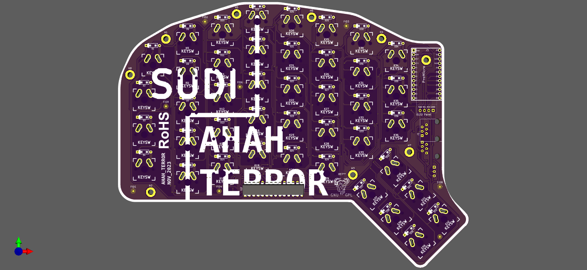

# Sudi Keyboard

<!--  -->
Sudi Keyboard is my redox clone, this keyboard will designed with 75% keyboard layout (84 key 42 each side).

## Reference 
[Redox-Keyboard](https://github.com/mattdibi/redox-keyboard)
