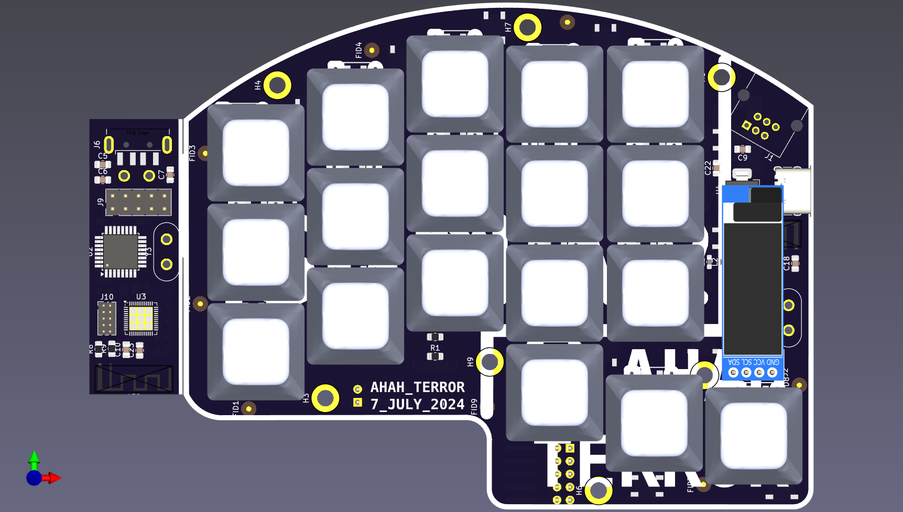

<h1 align="center">🌿 <i>SUDI</i> Keyboard V2</h1>
<p style="align: right;">
 
</p>

<p >
  <a href="">
    
  </a>
  <a href="">
    
  </a>
  <a href="">
    
  </a>
  <a href="https://github.com/ahsanu123/sudi-keyboard/blob/main/LICENSE">
    
  </a>
</p>


Sudi V2 is custom wireless split keyboard based on NRF51822 Nordic Semiconductor Microcontroller series, each side consist 18 keys 36 in totals, use MCP23017 I2C I/O expansion to scan one side of keyboard, and use wire to trasfer data to NRF51.
Sudi Have interactive RGB LED and OLED 0.91 inch for graphic display. Planned to create 3D print enclosure.

## 🖨️ Compile And Flash

**Ok!!**, I need 2 days (on my weekend) for figuring out how compile in NRF51 mcu with NRF5 SDK (at time of writing NRF5 SDK was obsolete/under maintenance only by Nordic Semiconductor). 

**FIRST** as far as i understand NRF51 MCU series only work with NRF5 sdk below version 12 (never complete compiling with version above 12), so you need to download NRF5 SDK version 12 or below. 

**SECOND** i have try to compile nrf project with cmake, but fail and make me stress, so i stick with makefile

**THIRD** debugging with `arm-eabi-none-gdb` a bit tricky you need perform several command before program go into breakpoint.

**FOURTH** you need to use old gcc compiler (gcc-arm-none-eabi-4_9-2015q3-20150921-linux.tar.bz2), there is some problem in linking process when you use new gcc version like v14

🍮 Step to Compile and flash
1. because we use makefile just call `make` in root directory
2. after complete you can use jlink or stlink to program your binary, nrf can programmed with swd
3. to use jlink you can use this command `sudo JLinkExe -Device NRF51822_XXAA -IF swd -AutoConnect 1 -Speed 1000` then you can load binary file with `loadfile ./path/to/file.out` (we use .out instead .elf)
4. to use stlink you can use this [script](https://github.com/vedderb/nrf51_vesc) you need change .out path
```shell
#!/bin/bash
openocd -f openocd.cfg -c "init" \
  -c "halt" \
  -c "nrf51 mass_erase" \
  -c "program ./build/binary.out verify reset exit"
```

## 🐞 Debugging Step
to debug you can use openocd + stlink, openocd + jlink, ozone. make sure to change `gdbcmd.txt` based on your setting (gdb port, output filename, etc.)

```shell
//🗒️🗒️🗒️🗒️ gdbcmd.txt 🗒️🗒️🗒️🗒️🗒️
// you need to connect into server first before choosing `file` to debug, 
target extended-remote :3333
file ./build/nrf51822_xxaa.out
break main
continue
```

- openocd + stlink
  first start openocd gdb server with this command
  
 ```shell
   sudo openocd -f interface/stlink-v2.cfg -f target/nrf51.cfg &
  ```
 
  next you can use `arm-none-eabi-gdb` to debug your program, run this command on other terminal `arm-none-eabi-gdb -x gdbcmd.txt`

- openocd + jlink
 you can start jlink gdb server with this command `sudo JLinkGDBServerExe &` then choose device and peripheral (swd) , or you can start server with openocd

 ```shell
  sudo openocd -f interface/jlink.cfg  -c "transport select swd; adapter speed 1000" -f target/nrf51.cfg
  ```

  next you can use `arm-none-eabi-gdb` to debug your program, run this command on other terminal `arm-none-eabi-gdb -x gdbcmd.txt`
  
- ozone
  last option you can use segger ozone. (not trying yet)

## 💾 hardware 
hardware is designed with kicad, you can find out hardware design in `pcb-design` folder. 
- schematic: [sudi schematic](pcb-design/output/sudi-redox-keyboard-Schematic.pdf)

casing is designed with PTC CREO, and use cutting acrylic (not uploaded/complete yet but planned)  
<details>
  <summary>Expand Me </summary>
  <p align="center">
  <a href="https://youtu.be/LN7CI2rUKP8">
    
  </a>
</p>


</details>

## 🧱 TODO List 
- try to understand why linker script flash ram address need to change from `0x8000` to `0x4000` [look this thread](https://devzone.nordicsemi.com/f/nordic-q-a/78577/nrf-sdk-pre-built-blinky-hex-works-compiled-hex-does-not-nrf51822)
  

## 💳 Reference 
- [you need to read this if blink example not working](https://devzone.nordicsemi.com/f/nordic-q-a/78577/nrf-sdk-pre-built-blinky-hex-works-compiled-hex-does-not-nrf51822)
- [NRF51 Series Documentation](https://www.nordicsemi.com/Products/nRF51822/GetStarted)
- [Redox-Keyboard](https://github.com/mattdibi/redox-keyboard) i use redox schematic for initial design  
- [MCP23017 datasheet](reference/MCP23017-20001952c.pdf) and add my *initial redox sch* with MCP23017

<sup>🔥 make it V2 - 19 juni 2024 10:49</sup>
