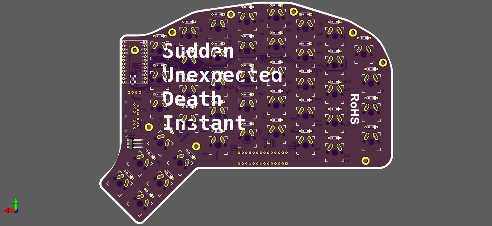

# Sudi Keyboard

<!--  -->
Sudi Keyboard is my redox clone, this keyboard will designed with 75% keyboard layout (84 key 42 each side).
Sudi keyboard is custom split keyboard based on QMK, its use MCP23017 for scanning key matrix on right side, use promicro for scanning left side. right now sudi is not come with rgb led but its planned.
each side consist 84 standard mechanical key, 

## how to compile 
to build firmware you can follow qmk documentation on: https://docs.qmk.fm/#/newbs_building_firmware, create new keyboard then copy replace `sudi/firmware` to newly created qmk keyboard folder.
source code is copied and modified from mark story article: http://mark-story.com/posts/view/building-a-split-keyboard-part-3.  

## hardware 
hardware is designed with kicad, you can find out hardware design in `pcb-design` folder. 
- schematic: [sudi schematic](pcb-design/output/sudi-redox-keyboard-Schematic.pdf)

casing is designed with PTC CREO, and use cutting acrylic (not uploaded yet but planned)

## Reference 
- [Redox-Keyboard](https://github.com/mattdibi/redox-keyboard) i use redox schematic for initial design  
- [MCP23017 datasheet](reference/MCP23017-20001952c.pdf) and add my *initial redox sch* with MCP23017  
